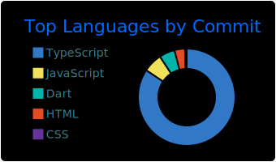
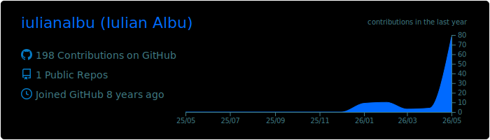
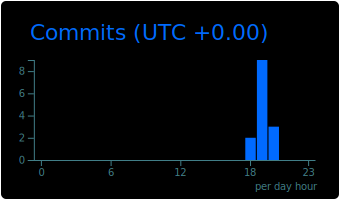

# Iulian Albu

<table>
<tr>
<td valign="top" width="40%">

Technical Lead building frontend at scale with secure architecture and systems design. TypeScript / React / Node across e-commerce, telecom, and industrial OT. Turns vague requirements into shipped product. Allergic to meetings that should have been a Slack thread.

 

</td>
<td valign="top" width="60%">

</td>
</tr>
<tr>
<td colspan="2">

<picture>
  <source media="(prefers-color-scheme: dark)" srcset="https://raw.githubusercontent.com/iulianalbu/iulianalbu/output/github-contribution-grid-snake-dark.svg">
  <source media="(prefers-color-scheme: light)" srcset="https://raw.githubusercontent.com/iulianalbu/iulianalbu/output/github-contribution-grid-snake.svg">
  
</picture>

</td>
</tr>
</table>

---

Trails, cameras, perspective. Best bugs get solved on a hike.
