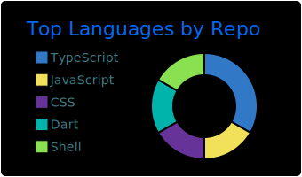

# Iulian Albu

Technical Lead · frontend at scale · secure architecture · systems design

<a href="https://iulianalbu.dev"></a>
<a href="https://linkedin.com/in/iulianalbu"></a>


---

<table>
<tr>
<td valign="top" width="55%">

```ts
const me = {
  role: "Technical Lead",
  focus: ["frontend at scale", "secure architecture", "systems design"],
  domains: ["e-commerce", "telecom", "industrial security / OT"],
  currently: ["architecting", "mentoring devs → tech leads", "pretending the new framework fixes everything"],
  superpower: "turning vague requirements into shipped product",
  kryptonite: "meetings that should've been a Slack thread",
};
```

</td>
<td valign="top" width="45%">



</td>
</tr>
</table>

---

<picture>
  <source media="(prefers-color-scheme: dark)" srcset="https://raw.githubusercontent.com/iulianalbu/iulianalbu/output/github-contribution-grid-snake-dark.svg">
  <source media="(prefers-color-scheme: light)" srcset="https://raw.githubusercontent.com/iulianalbu/iulianalbu/output/github-contribution-grid-snake.svg">
  
</picture>

---

Trails, cameras, perspective. Best bugs get solved on a hike.
