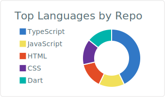
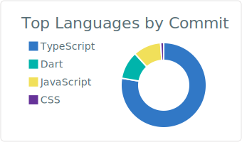

# iulianalbu

Technical Lead. Frontend, architecture, systems design.

<a href="https://iulianalbu.dev"></a>
<a href="https://www.linkedin.com/in/iulianalbu"></a>

---

### `whoami`

```ts
const me = {
  role: "Technical Lead",
  focus: ["frontend at scale", "secure architecture", "systems design"],
  domains: ["e-commerce", "telecom", "industrial security / OT"],
  superpower: "turning vague requirements into shipped product",
  kryptonite: "meetings that should've been a Slack thread",
};
```

### Currently

- Architecting things that probably shouldn't be on the public internet
- Mentoring devs into seniors into tech leads
- Pretending the new framework will fix everything

### Most used (auto, from GitHub)

<p>
  
  
</p>

<sub>Regenerated daily by a GitHub Action. Languages only — frameworks aren't auto-detected, but it's mostly React/Angular/Next/Expo on top.</sub>

### Off the clock

Trails, cameras, perspective. Best bugs get solved on a hike.
