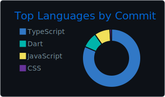
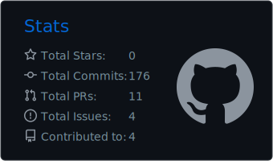
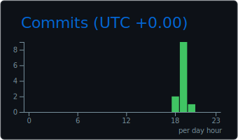

# iulianalbu

Technical Lead. Frontend, architecture, systems design.

<a href="https://iulianalbu.dev"></a>
<a href="https://www.linkedin.com/in/iulianalbu"></a>

---

### `whoami`

```ts
const me = {
  role: "Technical Lead",
  focus: ["frontend at scale", "secure architecture", "systems design"],
  domains: ["e-commerce", "telecom", "industrial security / OT"],
  superpower: "turning vague requirements into shipped product",
  kryptonite: "meetings that should've been a Slack thread",
};
```

### Currently

- Architecting things that probably shouldn't be on the public internet
- Mentoring devs into seniors into tech leads
- Pretending the new framework will fix everything

### Most used (auto, from GitHub)

<p>
  
  
</p>
<p>
  
</p>

<sub>Regenerated daily by a GitHub Action (`github_dark` theme).</sub>

### Contribution snake

<picture>
  <source media="(prefers-color-scheme: dark)" srcset="https://raw.githubusercontent.com/iulianalbu/iulianalbu/output/github-contribution-grid-snake-dark.svg">
  <source media="(prefers-color-scheme: light)" srcset="https://raw.githubusercontent.com/iulianalbu/iulianalbu/output/github-contribution-grid-snake.svg">
  
</picture>

### Off the clock

Trails, cameras, perspective. Best bugs get solved on a hike.
