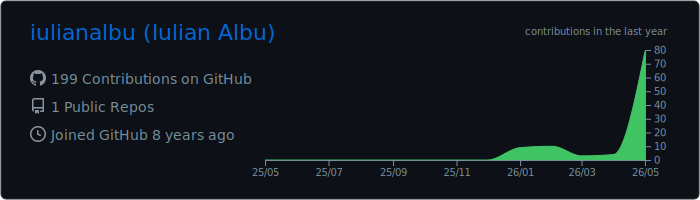
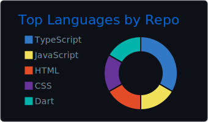

# Iulian Albu

Technical Lead · frontend at scale · secure architecture · systems design

<a href="https://iulianalbu.dev"></a>

---

```ts
const me = {
  role:       "Technical Lead",
  focus:      ["frontend at scale", "secure architecture", "systems design"],
  domains:    ["e-commerce", "telecom", "industrial security / OT"],
  currently:  ["architecting", "mentoring devs into seniors into tech leads", "pretending the new framework will fix everything"],
  superpower: "turning vague requirements into shipped product",
  kryptonite: "meetings that should've been a Slack thread",
};
```

---

<p align="center">
  
</p>
<p align="center">
  
  
</p>
<p align="center">
  
  
</p>

<sub>Regenerated daily · <code>github_dark</code> theme</sub>

---

<picture>
  <source media="(prefers-color-scheme: dark)" srcset="https://raw.githubusercontent.com/iulianalbu/iulianalbu/output/github-contribution-grid-snake-dark.svg">
  <source media="(prefers-color-scheme: light)" srcset="https://raw.githubusercontent.com/iulianalbu/iulianalbu/output/github-contribution-grid-snake.svg">
  
</picture>

---

Trails, cameras, perspective. Best bugs get solved on a hike.
